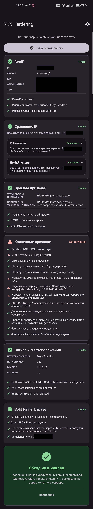

# NekoBox форк с патчами безопасности

Форк NekoBox с закрытыми уязвимостями и настройками под реалии рунета.

## Скачать

[GitHub Releases](https://github.com/kkkyloo/NekoBoxForAndroid/releases)

- **arm64-v8a** — почти все современные телефоны
- **armeabi-v7a** — старые 32-битные устройства

## RKN Hardening

Скриншот RKN Hardening

## Что изменено

- 🛡 Закрыта утечка IP через localhost — порт 10808 не открывается в VPN-режиме
- 🛡 sniff_override_destination = false — сниффер читает домен только для маршрутизации, не подменяет оригинальный IP
- 🇷🇺 Bypass для .ru / .рф / .su и российских IP из коробки
- 🐞 Фикс отображения всех приложений в списке VPN
- ⚙️ Direct DNS переключён на системный local
- ⚙️ Тест подключения на HTTPS
- 🧹 Скрыты опасные настройки из UI

## Первый запуск

Настройки → Режим VPN для приложений → включить переключатель → выбрать "Прокси" → отметить нужные приложения.

## Credits

Оригинальный проект: [MatsuriDayo/NekoBoxForAndroid](https://github.com/MatsuriDayo/NekoBoxForAndroid)

Core:
- [SagerNet/sing-box](https://github.com/SagerNet/sing-box)

Android GUI:
- [shadowsocks/shadowsocks-android](https://github.com/shadowsocks/shadowsocks-android)
- [SagerNet/SagerNet](https://github.com/SagerNet/SagerNet)